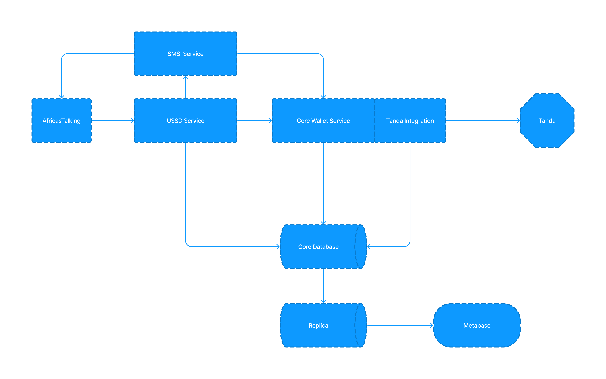

# introduction

Digital Wallet backed is a USSD based wallet that enables users to receive money to their digital wallet from mobile money wallet and transact to various sources i.e make bank payments, mobile money payments, p2p payments to another digital wallet, Till number and paybill payments.

This backend is divided into 3 services

* Core `[/src]`- Flask server acting as the core that glues all services and connects to our main postgres database. It Exposes all APIs needed to perform any manupulation of the digital wallet

* SMS service `[/sms]` - A python lambda that sends SMS via Africastaking API

* USSD service `[/ussd]` - A JS lambda that handles USSD webhooks from Africa's talking USSD service to serve the relevant menu in the USSD flow. Uses APIs from the Core to access and manipulate the digital wallet.

