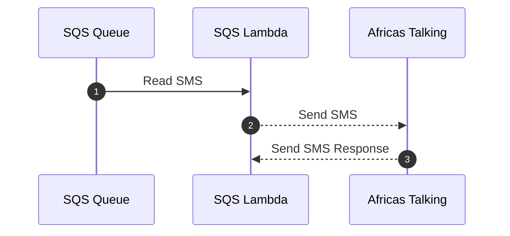
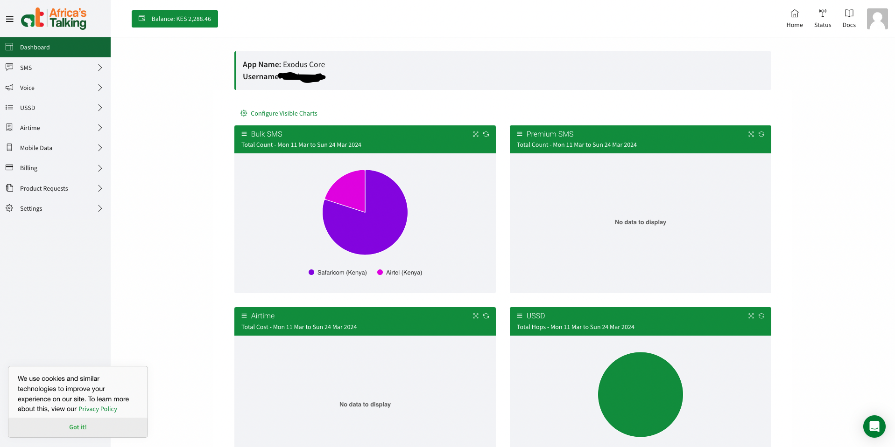

# SMS Service

### Intro

This is the service that we use to send SMS through our [Africastalking SMS account](https://africastalking.com/).
The service consists of an SMS SQS queue and an SMS lambda that listens on messages
on the SMS queue then sends it through Africas talking.

### SMS SQS Queue

The SMS SQS queue is an [AWS SQS queue](https://aws.amazon.com/sqs/) named `africastalking-queue` deployed in aws region `me-south-1`. The queue definition was done via terraform and files are found in [/terraform/sqs/sms/*](https://github.com/Exodus-Mobility/dw-backend/tree/main/terraform/sqs/sms)

!!! note
    To update the queue or it's properties update the queue's terraform files with the properties you want and apply the terrafom changes using `terraform apply`

### SMS lambda

The SMS Lambda is an [AWS lambda function](https://aws.amazon.com/pm/lambda/) named `sms_astalking` deployed in AWS region `me-south-1`. The lambda function definition is done in terraform and the files are found in [/terraform/sms/lambda/*](https://github.com/Exodus-Mobility/dw-backend/tree/main/terraform/sms/lambda). The functions dependencies are bundled into lambda layers which the function uses. The lambda layer terraform definition is found in [/terraform/sms/layers/*](https://github.com/Exodus-Mobility/dw-backend/tree/main/terraform/sms/layers). The function source code is written in python3 and it is found in [/sms/*](https://github.com/Exodus-Mobility/dw-backend/tree/main/sms)

!!! note
    To update the function raise a PR with your changes on either terraform or the source code, when you merge the code the changes will be auto deployed.

### Secrets

The SMS Lambda function has 2 secrest configured `AFRICASTALKING_USERNAME` and `AFRICASTALKING_API_KEY`. The `AFRICASTALKING_USERNAME` is found on our africastalking dashboard bellow the app name as Username

The `AFRICASTALKING_API_KEY` is generated by cliking settings on the africastalking dashboad then API key. You will be propted to eneter your password to generate the key.

!!! danger

    if you generate a new API key the one configured in production will stop being valid and SMSs being sent will fail. You will need to update this production secret with the one you generated then do a re-deploy of the SMS lambda function

The two secrets are stored on our side using [AWS Secrets manager](https://aws.amazon.com/secrets-manager/) the secret key is called `africastalking-prod-secrets`. To update these values log into the AWS console and go to  Secrets Manager. From the list of secrets, choose `africastalking-prod-secrets`. On the secret details page, on the Overview tab, in the Secret value section, choose Retrieve secret value and then choose Edit, the update the secrets.

