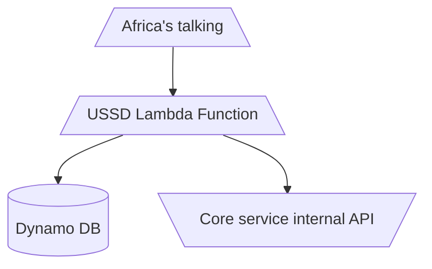
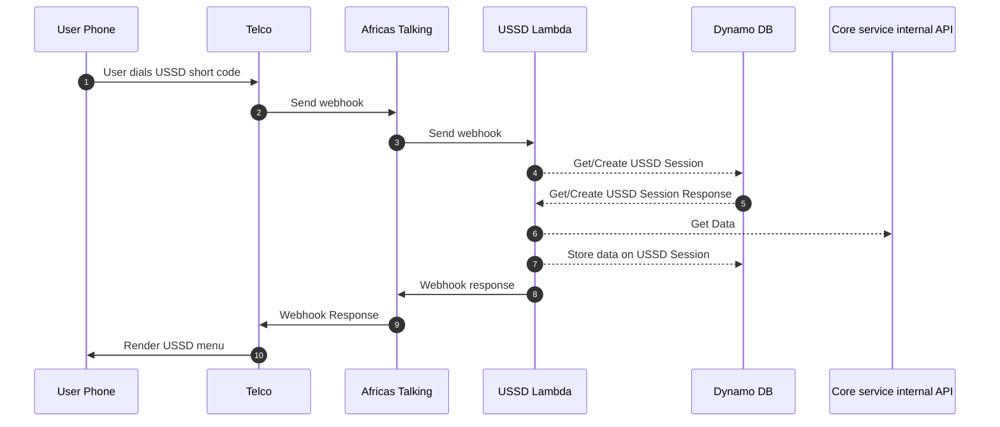
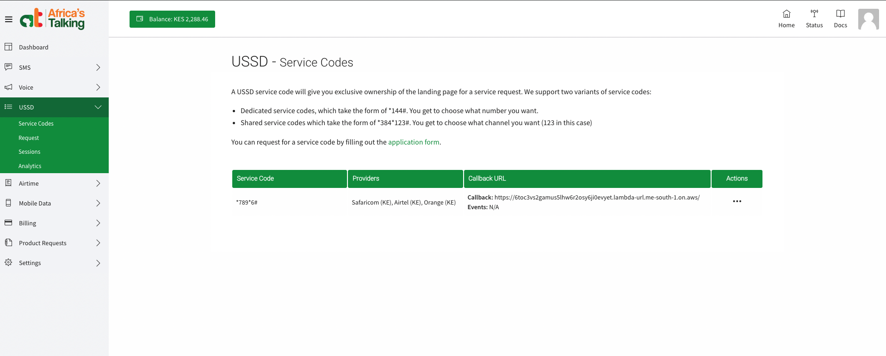
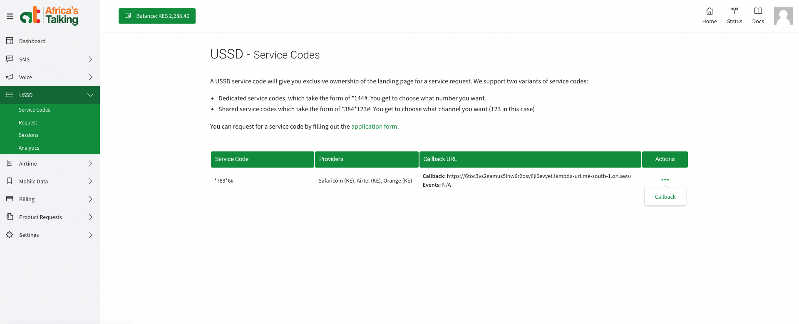
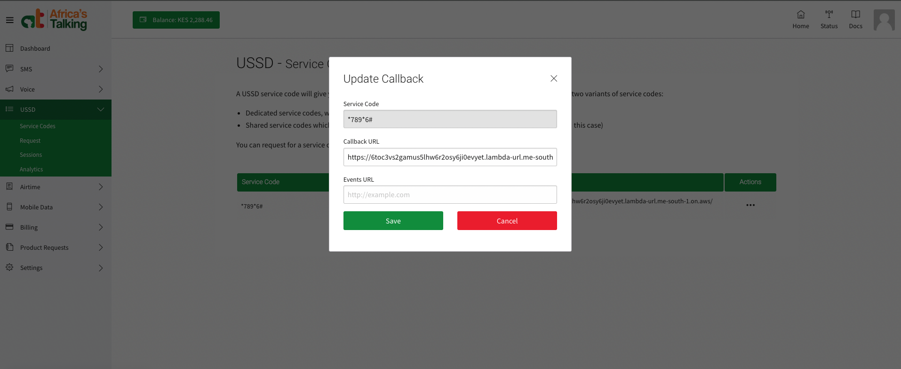

# USSD Service

### Intro

This is the service that we use to handle USSD redirection webhooks from [Africastalking](https://africastalking.com/) when a user dials our USSD code `*7*8*9*6#`. The service consists of a USSD lambda (exposes a lambda URL which we configure on our USSD shortcode on the Africastlaking dashboad as our USSD code's callback URL), and a dynamo DB to store USSD sessions and user inputs.

### USSD lambda

The USSD Lambda is an [AWS lambda function](https://aws.amazon.com/pm/lambda/) named `ussd-lambda` deployed in AWS region `me-south-1`. The lambda function definition is done in terraform and the files are found in [/terraform/ussd/lambda/*](https://github.com/Exodus-Mobility/dw-backend/tree/main/terraform/ussd/lambda). The functions dependencies are bundled into lambda layers which the function uses. The lambda layer terraform definition is found in [/terraform/ussd/layers/*](https://github.com/Exodus-Mobility/dw-backend/tree/main/terraform/ussd/layers). The function source code is written in Javascript and it is found in [/ussd/*](https://github.com/Exodus-Mobility/dw-backend/tree/main/ussd)

!!! note
    To update the function raise a PR with your changes on either terraform or the source code, when you merge the code the changes will be auto deployed.

### Dynamo DB

The USSD Dynamodb is an [AWS Amazon DynamoDB table](https://aws.amazon.com/pm/dynamodb/) named `ussd-sessions` deployed in aws region `me-south-1`. The Dynamodb definition was done via terraform and files are found in [/terraform/data_stores/dynamodb/*](https://github.com/Exodus-Mobility/dw-backend/tree/main/terraform/data_stores/dynamodb)

!!! note
    To update the Dynamodb table or it's properties update the queue's terraform files with the properties you want and apply the terrafom changes using `terraform apply`

### Africastalking USSD Code callback configuration

!!! danger

    Updating the callback URL will casue your USSD service to have downtime if you configure it to an invalid URL(URL that is not the USSSD lambda URL) We suggest that you backup the existing value so that you can rollback if you make a mistake.

-  On the Africastalking dashboad click USSD then select Service Codes. 

-  On the list of the service Codes that apper click the  humbager on the srervice code that you want to update and select callback.

-  On pop up menu that appers update the callback URL with the new URL or your lambda if you are changeing the service to pint to a new lambda or USSD service.

-  click save to save and exit.
