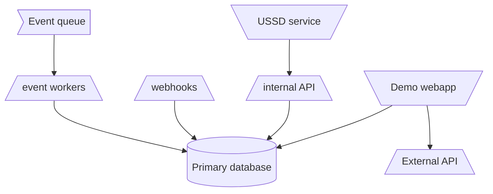

# Core Service

### Intro

The core service is a serise of micro services built in python/Flask and connected to our main postgres database. It Exposes all APIs needed to perform any manupulation of the digital wallet. It has two types of APIs it exposes 1. internal API (Used by the ussd service to manupilate and query the wallet) 2. External API (Used by the demo webapp to manipulate and query the wallet). The core services consists of 3 types of layers; API layer, Webhook layer and worker layer which are deployed as separate micro services in docker containers on AWS ECS.




### Load Balancers

We use Application loadbalancers (ALBs) to balanace the tarffic going to our Apps running on ECS services (containers), the ECS services are atached to the ALBs via target groups. We have two types of loadbalances that we expose to all our services:

1.  [Internal Load balancer](https://github.com/Exodus-Mobility/dw-backend/blob/main/terraform/alb/main.tf#L22) - This load balancer is named `backend` and is deployed on our internal subnet of our VPC (This subnet is not accesible over the public internet). In this Load balancer we attach API services that we don not want things to reach directly from the internet. Services attached here currently are
    - Internal API/ USSD API
    - Extrenal API/ WEB API

    !!! info
        If you use the terraform module [ecs_service](https://github.com/Exodus-Mobility/dw-backend/tree/main/terraform/modules/ecs_service) to create your service it will be attached to the internal ALB by default unless you specify otherwise.


2.  [External Load balancer](https://github.com/Exodus-Mobility/dw-backend/blob/main/terraform/external_alb/main.tf#L22) - This load  balancer is named `backend-external` and is deployed in our External subnets of our VPC(This subnet is accesible over the public internet). In this Load balancer we attach API services that we  want things to reach directly from the internet. Services attached here currently are:
    - Webhooks
    - Flask Admin
    - Metabase

    !!! info
        If you use the terraform module [ecs_service](https://github.com/Exodus-Mobility/dw-backend/tree/main/terraform/modules/ecs_service) to create your service, you will need to specify `load_balancer_name    = "backend-external"` so that your service can be attached to this loadbalancer. 


### Internal API/ USSD API

This is the API that is only exposed to internal api clients (Clients that are on our Production virtual private cloud) e.g the USSD service. This API is authenticated via basic authentication where the user name is the wallet owner phone number and the password  is the wallet owners wallet pin. This API primarily supports the USSD operation and it was designed to share as much data in one call to minimize the roundtrip in the USSD session.

The internal API micro service is  an [AWS ECS service](https://aws.amazon.com/ecs/) named `core-api` deployed in AWS region `me-south-1`. The Ecs service definition is done in terraform and the files are found in [/terraform/core_ecs_service/*](https://github.com/Exodus-Mobility/dw-backend/tree/main/terraform/core_ecs_service). The flask blueprints for this micro service are found in [/usrc/api/blueprints/*  excluding web folder](https://github.com/Exodus-Mobility/dw-backend/tree/main/src/api/blueprints/core)

#### Extending Internal API/ USSD API

To extedend the USSD API by ading a new endpoint can be done in 2 ways

1. Adding an API endpoint on an existing falsk blueprint
2. Adding an API endpoint by adding a new falsk bleuprint

##### Adding An API Endpoint On An Existing Falsk Blueprint
Lets assume that we wanted to add a get /example_url endpoint on the [beneficiary blueprint](https://github.com/Exodus-Mobility/dw-backend/blob/main/src/api/blueprints/core/beneficiary.py). We will need to:

1. Create the new flask view named ExampleView on the  [beneficiary.py blueprints file](https://github.com/Exodus-Mobility/dw-backend/blob/main/src/api/blueprints/core/beneficiary.py).

    ``` py linenums="77"

    class ExampleView(flask.views.MethodView):
        def get():
            return flask.Response()

    ```

2. Regiseter the `ExampleView` you've created above to the beneficiary blueprint by adding the following entries on the [create_blueprint function](https://github.com/Exodus-Mobility/dw-backend/blob/main/src/api/blueprints/core/beneficiary.py#L80) inside the beneficiary.py blueprint file.

    ``` py hl_lines="24 25 26 27" linenums="60" 

    def create_blueprint(at_prefix, **kwargs):
        blueprint = flask.Blueprint("Beneficiary", __name__)
        blueprint.api_url_for_cache = {}
        blueprint.before_request(set_global_user)
        blueprint.after_request(remove_global_user)
        blueprint.register_error_handler(APIError, make_api_error)

        def add_url_rule(rule, view_func):
            blueprint.add_url_rule(rule, view_func=view_func)
            key = "Core_{}".format(view_func.__name__)
            if key in blueprint.api_url_for_cache:
                raise ValueError("{} is already in the url_for_cache".format(key))
            blueprint.api_url_for_cache[key] = "{}{}".format(at_prefix, rule)

        add_url_rule(
            "/beneficiary",
            view_func=BeneficiaryView.as_view("Beneficiary"),
        )
        add_url_rule(
            "/supported_banks",
            view_func=BeneficiaryBankView.as_view("Banks"),
        )

        add_url_rule(
            "/example_url",
            view_func=ExampleView.as_view("example"),
        )
        return blueprint

    ```


3. create githiub pull request agains master, get a review and after being approved merge the changes to master.
4. When the changes are merged to master the CI/CD pipline kicks on an automatically deploys your changes. 
5. When the deploy is complete your new endpoint should be available to the ussd app via `GET http://internal-backend-892516406.me-south-1.elb.amazonaws.com/api/example_url`


##### Adding an API endpoint by adding a new falsk bleuprint

Lets assume we want to add a new blueprint to the web API called example.py that conatians a flask view named ExampleView that returns a 200 response for an authenticated get request. We will need to:

1. Create the new example.py blueprint file in [/src/api/blueprints/core/](https://github.com/Exodus-Mobility/dw-backend/tree/main/src/api/blueprints/core)

2. In the new blueprint we add the bew vie called ExampleView

    ``` py linenums="1"
    import flask.views


    class ExampleView(flask.views.MethodView):
        def get():
            return flask.Response()

    ```

3. Add the create_blueprint function and in it register the requred before and after request function hooks, error handler functions  and attach the view we have created.

    ``` py linenums="1"
    import flask
    import flask.views
    from api.blueprints.common import api_json_response, make_api_error, remove_global_user, set_global_user
    from api.blueprints.errors import APIError


    class ExampleView(flask.views.MethodView):
        def get():
            return flask.Response()

    
    def create_blueprint(at_prefix, **kwargs):
        blueprint = flask.Blueprint("Example", __name__)
        blueprint.api_url_for_cache = {}
        blueprint.before_request(set_global_user)
        blueprint.after_request(remove_global_user)
        blueprint.register_error_handler(APIError, make_api_error)

        def add_url_rule(rule, view_func):
            blueprint.add_url_rule(rule, view_func=view_func)
            key = "Core_{}".format(view_func.__name__)
            if key in blueprint.api_url_for_cache:
                raise ValueError("{} is already in the url_for_cache".format(key))
            blueprint.api_url_for_cache[key] = "{}{}".format(at_prefix, rule)


        add_url_rule(
            "/example_url",
            view_func=ExampleView.as_view("example"),
        )

        return blueprint

    ```

4. On the [/terraform/core_ecs_service/main.tf](https://github.com/Exodus-Mobility/dw-backend/blob/main/terraform/core_ecs_service/main.tf#L6) update the entry_point to start this new blueprint.

    ``` tf linenums="1"
    module "core-service" {
    source                 = "../modules/ecs_service"
    service_name          = "core"
    launch_name_prefix     = "core-api"
    path_pattern           = "/api/*"
    entry_point            = ["api-run-server", "--workers", "2", "-i", "0.0.0.0", "-trace-id", "X-Amzn-Trace-Id", "core.example:/api",  "core.login_registartion:/api", "core.beneficiary:/api", "core.account:/api", "core.health:/api"]
    }
    ```

5. create githiub pull request agains master, get a review and after being approved merge the changes to master.
6. When the changes are merged to master the CI/CD pipline kicks on an automatically deploys your changes. 
7. When the deploy is complete your new endpoint should be available to the ussd app via `GET http://internal-backend-892516406.me-south-1.elb.amazonaws.com/api/example_url`


### Extrenal API/ WEB API

This is the API that is exposed to external api clients (Clients that are anywhere on the internet) via the [AWS API gateway](https://aws.amazon.com/api-gateway/) e.g the Demo web APP. This API is authenticated via token based authentication where the bearer toke  is the cleark jwt token of an authenticated user on our cleark account.


The External API micro service is  an [AWS ECS service](https://aws.amazon.com/ecs/) named `web-core` deployed in AWS region `me-south-1`. The Ecs service definition is done in terraform and the files are found in [/terraform/web_core_ecs_service/*](https://github.com/Exodus-Mobility/dw-backend/tree/main/terraform/web_core_ecs_service). The flask blueprints for this micro service are found in [/usrc/api/blueprints/web/* ](https://github.com/Exodus-Mobility/dw-backend/tree/main/src/api/blueprints/core/web)

The web API blueprints uses the [`set_clerk_global_user`](https://github.com/Exodus-Mobility/dw-backend/blob/main/src/api/blueprints/common.py#L87) function to check authentication and pull a user from a cleark id conatained on the cleark JWT tokn.

If you are creating an Example Blueprint and you want to add cleark authentication, register the set_clerk_global_user function as a before request handler as shown bellow.


``` py
...
import flask.views
from api.blueprints.common import api_json_response, make_api_error, remove_global_user, set_clerk_global_user
from api.blueprints.errors import APIError
...

class ExampleView(flask.views.MethodView):
    def get():
        ...

def create_blueprint(at_prefix, **kwargs):
    blueprint = flask.Blueprint("Example blueprint", __name__)
    blueprint.api_url_for_cache = {}
    blueprint.before_request(set_clerk_global_user)
    blueprint.after_request(remove_global_user)
    blueprint.register_error_handler(APIError, make_api_error)

    def add_url_rule(rule, view_func):
        blueprint.add_url_rule(rule, view_func=view_func)
        key = "Core_{}".format(view_func.__name__)
        if key in blueprint.api_url_for_cache:
            raise ValueError("{} is already in the url_for_cache".format(key))
        blueprint.api_url_for_cache[key] = "{}{}".format(at_prefix, rule)


    add_url_rule(
        "/example_url",
        view_func=ExampleView.as_view("example"),
    )

    return blueprint

```


The API gateway is named backend-apigw is defined interraform in [/terraform/api_gateway/*](https://github.com/Exodus-Mobility/dw-backend/tree/main/terraform/api_gateway) the definition consits of:

- [The API gateway DNS](https://github.com/Exodus-Mobility/dw-backend/blob/main/terraform/api_gateway/main.tf#L6) api.exodusmobility.io
- [The API gateway integration](https://github.com/Exodus-Mobility/dw-backend/blob/main/terraform/api_gateway/main.tf#L24) which is a v2 integration that is a HTTP_PROXY integration to the internal Aplication Load balancer via the [API gateway VPC link](https://github.com/Exodus-Mobility/dw-backend/tree/main/terraform/apigw_vpc_link).
- [The API gateway route](https://github.com/Exodus-Mobility/dw-backend/blob/main/terraform/api_gateway/main.tf#L44) to route any traffic hitting it at `/api/*` to be fowarded to the internal ALB via the above gateway integration.


#### Extending Extrenal API/ WEB API

To extedend the Web API by ading a new endpoint can be done in 2 ways

1. Adding an API endpoint on an existing falsk blueprint
2. Adding an API endpoint by adding a new falsk bleuprint

##### Adding An API Endpoint On An Existing Falsk Blueprint
Lets assume that we wanted to add a get transaction by QID endpoint on the [transactions blueprint](https://github.com/Exodus-Mobility/dw-backend/blob/main/src/api/blueprints/core/web/transactions.py). We will need to:

1. Create the new flask view named TransactionView on the  [transactions.py blueprints file](https://github.com/Exodus-Mobility/dw-backend/blob/main/src/api/blueprints/core/web/transactions.py).

    ``` py linenums="50"

    class TransactionView(flask.views.MethodView):
        def get(self, qid):
            user = get_global_user()
            try:
                transaction = Receipt.from_qid(qid)
            except ValueError:
                CommonErrorCode.BAD_ARGUMENT_VALUE(reason="Invalid transaction_qid")
            return api_json_response(ReceiptSerializer(transaction), 200)

    ```

2. Regiseter the `TransactionView` you've created above to the transactions blueprint by adding the following entries on the [create_blueprint function](https://github.com/Exodus-Mobility/dw-backend/blob/main/src/api/blueprints/core/web/transactions.py#L54) inside the transactions.py blueprint file.

    ``` py hl_lines="20 21 22 23 24" linenums="60" 

    def create_blueprint(at_prefix, **kwargs):
        blueprint = flask.Blueprint("Transactions", __name__)
        blueprint.api_url_for_cache = {}
        blueprint.before_request(set_clerk_global_user)
        blueprint.after_request(remove_global_user)
        blueprint.register_error_handler(APIError, make_api_error)

        def add_url_rule(rule, view_func):
            blueprint.add_url_rule(rule, view_func=view_func)
            key = "Core_{}".format(view_func.__name__)
            if key in blueprint.api_url_for_cache:
                raise ValueError("{} is already in the url_for_cache".format(key))
            blueprint.api_url_for_cache[key] = "{}{}".format(at_prefix, rule)


        add_url_rule(
            "/transactions",
            view_func=TransactionsView.as_view("transactions"),
        )

        add_url_rule(
            "/transaction/<qid>",
            view_func=TransactionView.as_view("transaction"),
        )

        return blueprint

    ```


3. create githiub pull request agains master, get a review and after being approved merge the changes to master.
4. When the changes are merged to master the CI/CD pipline kicks on an automatically deploys your changes. 
5. When the deploy is complete your new endpoint should be accesible via `GET https://api.exodusmobility.io/api/transaction/<qid>`


##### Adding an API endpoint by adding a new falsk bleuprint

Lets assume we want to add a new blueprint to the web API called example.py that conatians a flask view named ExampleView that returns a 200 response for an authenticated get request. We will need to:

1. Create the new example.py blueprint file in [/src/api/blueprints/core/web/](https://github.com/Exodus-Mobility/dw-backend/tree/main/src/api/blueprints/core/web)

2. In the new blueprint we add the bew vie called ExampleView

    ``` py linenums="1"
    import flask.views


    class ExampleView(flask.views.MethodView):
        def get():
            return flask.Response()

    ```

3. Add the create_blueprint function and in it register the requred before and after request function hooks, error handler functions  and attach the view we have created.

    ``` py linenums="1"
    import flask
    import flask.views
    from api.blueprints.common import api_json_response, make_api_error, remove_global_user, set_clerk_global_user
    from api.blueprints.errors import APIError


    class ExampleView(flask.views.MethodView):
        def get():
            return flask.Response()

    
    def create_blueprint(at_prefix, **kwargs):
        blueprint = flask.Blueprint("Example", __name__)
        blueprint.api_url_for_cache = {}
        blueprint.before_request(set_clerk_global_user)
        blueprint.after_request(remove_global_user)
        blueprint.register_error_handler(APIError, make_api_error)

        def add_url_rule(rule, view_func):
            blueprint.add_url_rule(rule, view_func=view_func)
            key = "Core_{}".format(view_func.__name__)
            if key in blueprint.api_url_for_cache:
                raise ValueError("{} is already in the url_for_cache".format(key))
            blueprint.api_url_for_cache[key] = "{}{}".format(at_prefix, rule)


        add_url_rule(
            "/example_url",
            view_func=ExampleView.as_view("example"),
        )

        return blueprint

    ```

4. On the [/terraform/web_core_ecs_service/main.tf](https://github.com/Exodus-Mobility/dw-backend/blob/main/terraform/web_core_ecs_service/main.tf#L8) update the entry_point to start this new blueprint.

    ``` tf linenums="1"
    module "web-core-service" {
    source                 = "../modules/ecs_service"
    number_of_containers   = 1
    service_name          = "web"
    alb_listener_port     = 443
    launch_name_prefix     = "web-core"
    path_pattern           = "/api/*"
    entry_point            = ["api-run-server", "--workers", "2", "-i", "0.0.0.0", "-trace-id", "X-Amzn-Trace-Id", "core.web.example:/api"  "core.web.account:/api", "core.web.health:/api", "core.web.beneficiary:/api", "core.web.transactions:/api"]
    }
    ```

5. create githiub pull request agains master, get a review and after being approved merge the changes to master.
6. When the changes are merged to master the CI/CD pipline kicks on an automatically deploys your changes. 
7. When the deploy is complete your new endpoint should be accesible via `GET https://api.exodusmobility.io/api/example_url`


### Webhooks

This is the micro service that handles webhook request from external platforms. Currently we recive webhooks from two platforms cleark and Tanda.

1. cleark - `SMS webhooks` -: OTP SMS to send to users phones via our SMS service
          - `User Webhooks` -: webhooks sent due to a user change event on cleark (creation, user update, user delete). We use these events to sync with cleark user accounts.

2. Tanda - `Tanda callbacks` :- callbacks that tanda sends back to us to update us on a transaction that we initiated via API
         - `Tanda Notifications` :- Notifications send to us when a user makes a payment via the Tanda paybill or bank account to topup their wallet

This  micro service is  an [AWS ECS service](https://aws.amazon.com/ecs/) named `ipn` deployed in AWS region `me-south-1`. The Ecs service definition is done in terraform and the files are found in [/terraform/ipn_ecs_service/*](https://github.com/Exodus-Mobility/dw-backend/tree/main/terraform/ipn_ecs_service). The flask blueprints for this micro service are found in [/usrc/api/blueprints/webhooks/* ](https://github.com/Exodus-Mobility/dw-backend/tree/main/src/api/blueprints/webhooks)

#### Configuring cleark webhooks 

- To Add a new cleark webhook go to the Clerk Dashboard and navigate to the [Webhooks](https://dashboard.clerk.com/last-active?path=webhooks&_gl=1*1e78ayw*_ga*MTg1NzAyNTExOS4xNzExMzc0NzE1*_ga_1WMF5X234K*MTcxMTM3NDcxNC4xLjEuMTcxMTM3NDczNC4wLjAuMA..*_gcl_au*MTU3NzcxNTkzMy4xNzExMzc0NzE1) page. Select the Add Endpoint button.


- You'll be presented with a form where you can specify the URL of your backend endpoint. This is the URL where Clerk will send the webhook events. You can also specify the events you want to receive. For example, if you only want to receive events related to users, you can select the user option.


- Once you click the Create button, you'll be presented with your webhook endpoint dashboard. Here you can see the URL of your endpoint and the events you selected and you can also test your endpoint


#### Configuring Tanda webhooks

Tanda webhooks are per virtual account and they are set at account creation. We usaually set the same endpoint which points to the webhook service. This config is added in code  for [callbacks](https://github.com/Exodus-Mobility/dw-backend/blob/main/terraform/modules/ecs_service_worker/data.tf#L62) and [confirmation](https://github.com/Exodus-Mobility/dw-backend/blob/main/terraform/modules/ecs_service_worker/data.tf#L63) endpoint 

To update this value Raise a pr and update those subsequent values then re-deploy all the services.

!!! danger

    Do not update these values if you don't understand the consiquences of that action. Updating the values will only affect the newly created accounts and you will neeed to backfill the others via tanda API


### Event Worker

This is the Micro service that listes to the events SQS queue and handle the event. Thi is  an [AWS ECS service](https://aws.amazon.com/ecs/) named `events-worker` deployed in AWS region `me-south-1`. The ECS service definition is done in terraform and the files are found in [/terraform/event_worker_ecs_service/*](https://github.com/Exodus-Mobility/dw-backend/tree/main/terraform/event_worker_ecs_service). The source code for this worker is found in [/usrc/api/workers/events_worker.py ](https://github.com/Exodus-Mobility/dw-backend/blob/main/src/api/workers/events_worker.py) The event types definitions and event handlers are found in [/usrc/api/events/*](https://github.com/Exodus-Mobility/dw-backend/tree/main/src/api/events)

Events can be triggerd from any micro service in the core service, this can be done by creating an event object form spcific event class and calling  `<event object>.emmit()` to trigger the event.

For example to create a debit acccount event :
``` py linenums="5"
event = DebitAccountEvent(
    account=account, 
    amount=receipt.amount, 
    narration="some narration}")
    event.emmit_delayed(delay_seconds=10)

```

#### Event Types

| Event Type                 | Description                          |
| :------------------------- | :--------------------------------------------------------|
| `REGISTER_ACCOUNT`         | register a wallet on exodus                              |
| `ADJUST_ACCOUNT_BALANCE`   | update a wallets account balance                         |
| `ACTIVATE_ACCOUNT_EVENT`   | sync a tanda wallet with the registerd exodus account    |
| `PAYMENT_STK_PUSH`         | send an stk push request to someoones phone              |
| `PAYMENT_DISBURSMENT`      | send  money from an exodus wallet to a valid chanel      |
| `PAYMENT_CHECK_STATUS`     | Check the satatus of a payment transacton on tandda      |


The event SQS queue is an [AWS SQS queue](https://aws.amazon.com/sqs/) named `events-queue` deployed in aws region `me-south-1`. The queue definition was done via terraform and files are found in [/terraform/sqs/events/*](https://github.com/Exodus-Mobility/dw-backend/tree/main/terraform/sqs/events)

!!! note
    To update the queue or it's properties update the queue's terraform files with the properties you want and apply the terrafom changes using `terraform apply`


### Data layer

We model the data layer of our core service around a postgres database. We use [sqlalchemy](https://www.sqlalchemy.org/) as the ORM to interact with the said database. The databsae table models are found in [/src/api/models/*](https://github.com/Exodus-Mobility/dw-backend/tree/main/src/api/models) of our code base.

We use [alembic](https://alembic.sqlalchemy.org/en/latest/) to migrate our database. This is done automatically when you merge your data bse migrations to the main branch. The alembic configuration file is located [here (alembic.ini)](https://github.com/Exodus-Mobility/dw-backend/blob/main/src/alembic.ini) and the migration files are located in [/src/api/models/alembic/versions/*](https://github.com/Exodus-Mobility/dw-backend/tree/main/src/api/models/alembic/versions)

All of our Alembic model classes *must* inherit from `model.BaseModel` class. This class is packed with utility methods and validators that are helpfull on the data layer. The new class will also be required to define a `__qid_prefix_` class variable and assign it a two letter workd to denote the QID that will be prefixed to the ID whil sharing the id via API. The QUD prefix selcted should not be already picked this value is unique.

see example to addd a new table called some_new_table:

Add the model class definition in models module

``` py linenums="20"
import sqlalchemy

import api.models as model
sa = sqlalchemy

class SomeNewTable(model.BaseModel):
    __tablename__ = "some_new_table"
    __qid_prefix__ = "SM"

    id = sa.Column(sa.Integer, primary_key=True)
    created_when = sa.Column(sa.DateTime, nullable=False)
    updated_when = sa.Column(sa.DateTime, onupdate=utcnow)
    name = sa.Column(sa.Text, unique=True, nullable=False)


```

run alembic command in folder `/src/` to generate a migration file in `/src/api/models/alembic/versions/` folder.

```sh
alembic revision -m "add new table some new table"
```

On the generated migration template file, edit to add the actual migration on the `upgrade` and `downgrade` functions

``` sh linenums="1"
"""Add new table some new table

Revision ID: 79525dgdge
Revises: 89999dbfdvfhf
Create Date: 2025-08-02 04:28:17.177534+00:00

"""

# revision identifiers, used by Alembic.
revision = "79525dgdge"
down_revision = "89999dbfdvfhf"

import sqlalchemy as sa
from alembic import op


def upgrade():
    op.create_table(
        "some_new_table",
        sa.Column("id", sa.Integer(), nullable=False),
        sa.Column("created_when", sa.DateTime(), nullable=False),
        sa.Column("updated_when", sa.DateTime(), nullable=True),
        sa.Column("name", sa.String(), nullable=False),,
        sa.PrimaryKeyConstraint("id", name=op.f("pk_users_")),,
    )


def downgrade():
    op.drop_table("some_new_table")

```

Raise a PR and when you merge your PR to production your migrations will be run automatically by the continous deployemnet pipeline


### Monitoring

We use [Sentry](https://sentry.io/welcome/) for alertiing us when the softawer crashes in production due to any unforseen errors or bugs or updates that may have been made.  This notification will point you to the point on the code that is the culprit.
For application logging This service uses [papertrail](https://www.papertrail.com/) to log. We use the papartrail dashboad to view the system logs on this microservice. use the two services to trobleshoot whenever you have issues with the system. 


### Secrets

The core service has 5 secrest configured `DATABASE_URI`, `FLASK_SECRET_KEY`, `TANDA_BASE_URL`, `TANDA_CLIENT_ID`, `TANDA_CLIENT_SECRET`, and `TANDA_ORG_ID`. The 5 secrets are stored on our side using [AWS Secrets manager](https://aws.amazon.com/secrets-manager/) the secret key is called `prod-secrets`. To update these values log into the AWS console and go to  Secrets Manager. From the list of secrets, choose `prod-secrets`. On the secret details page, on the Overview tab, in the Secret value section, choose Retrieve secret value and then choose Edit, the update the secrets.

!!! danger

    only update any othe above secrest if you know the consiquences of what you are doing, you may corrupt data or lead to a system failure.
    
